---
## Front matter
title: "Отчёт по лабораторной работе №1"
subtitle: "Установка и конфигурация операционной системы на виртуальную машину"
author: "Михаил Александрович Мелкомуков

## Generic otions
lang: ru-RU
toc-title: "Содержание"

## Bibliography
bibliography: bib/cite.bib
csl: pandoc/csl/gost-r-7-0-5-2008-numeric.csl

## Pdf output format
toc: true # Table of contents
toc-depth: 2
lof: true # List of figures
lot: true # List of tables
fontsize: 12pt
linestretch: 1.5
papersize: a4
documentclass: scrreprt
## I18n polyglossia
polyglossia-lang:
  name: russian
  options:
	- spelling=modern
	- babelshorthands=true
polyglossia-otherlangs:
  name: english
## I18n babel
babel-lang: russian
babel-otherlangs: english
## Fonts
mainfont: PT Serif
romanfont: PT Serif
sansfont: PT Sans
monofont: PT Mono
mainfontoptions: Ligatures=TeX
romanfontoptions: Ligatures=TeX
sansfontoptions: Ligatures=TeX,Scale=MatchLowercase
monofontoptions: Scale=MatchLowercase,Scale=0.9
## Biblatex
biblatex: true
biblio-style: "gost-numeric"
biblatexoptions:
  - parentracker=true
  - backend=biber
  - hyperref=auto
  - language=auto
  - autolang=other*
  - citestyle=gost-numeric
## Pandoc-crossref LaTeX customization
figureTitle: "Рис."
tableTitle: "Таблица"
listingTitle: "Листинг"
lofTitle: "Список иллюстраций"
lotTitle: "Список таблиц"
lolTitle: "Листинги"
## Misc options
indent: true
header-includes:
  - \usepackage{indentfirst}
  - \usepackage{float} # keep figures where there are in the text
  - \floatplacement{figure}{H} # keep figures where there are in the text
---

# Цель работы

Целью данной работы является ознакомление с процессом установки ОС Linux на виртуальную машину VirtualBox и настройкой основного программного обеспечения для дальнейшей работы.

# Задание

Настроить и создать виртуальную машину. Запустить виртуальную машину и установить систему. Научиться пользоваться ОС Linux на виртуальной машине. 

# Выполнение лабораторной работы

## Настройка и создание виртуальной машины

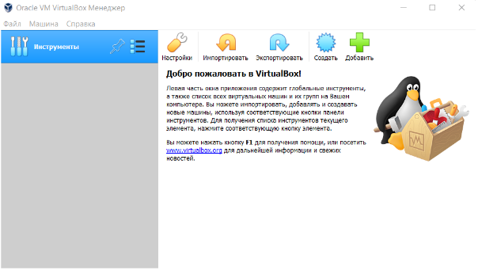

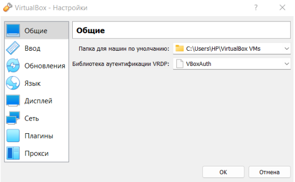

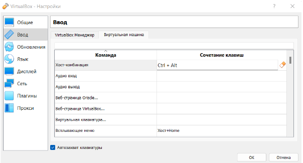

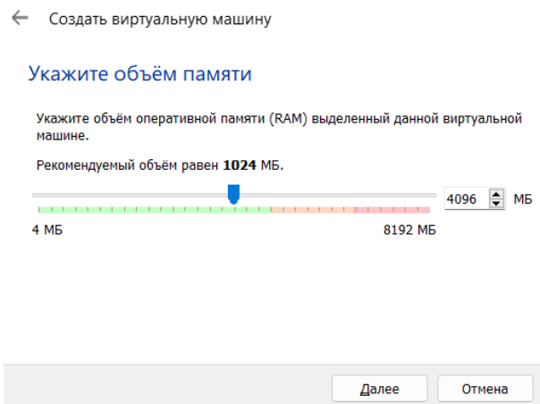

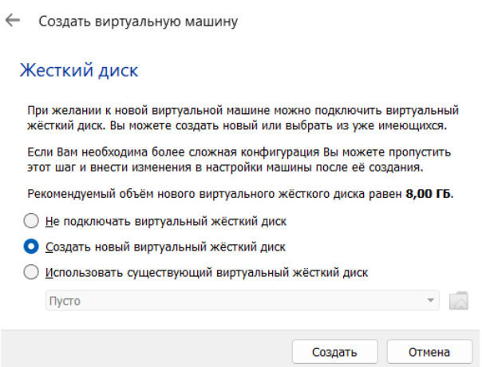

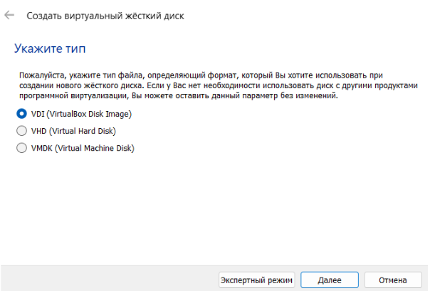

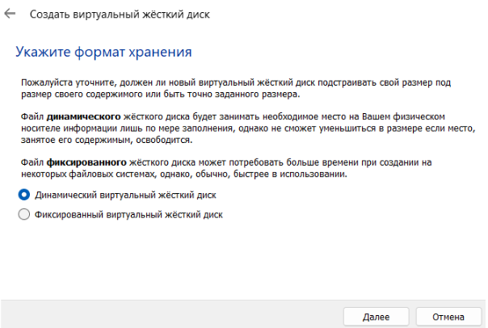

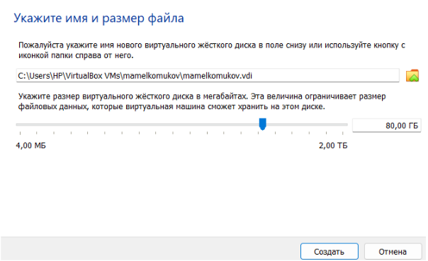

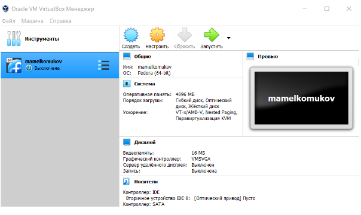

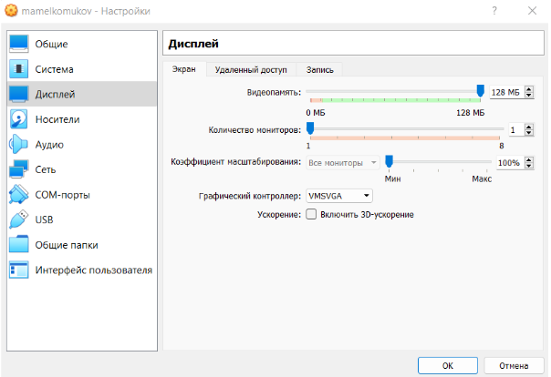

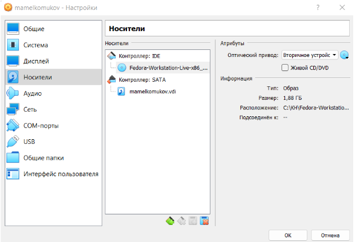

## Запуск виртуальной машины и установка системы

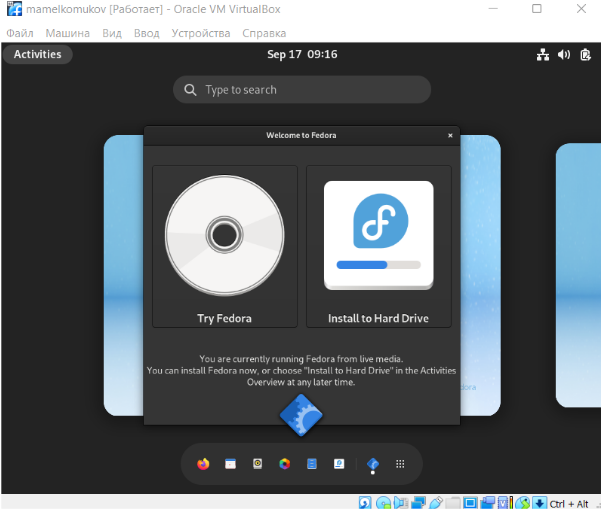

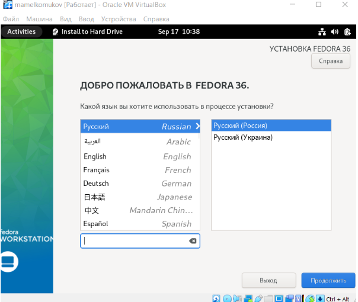

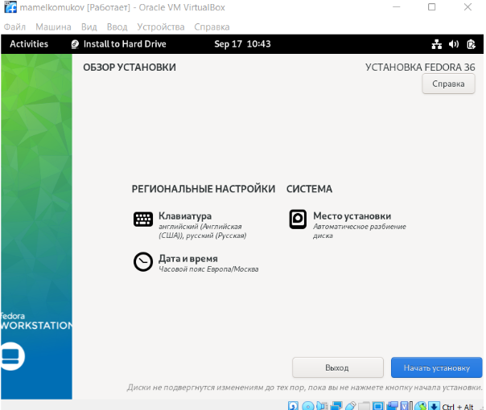

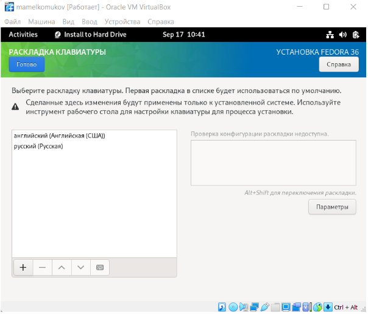

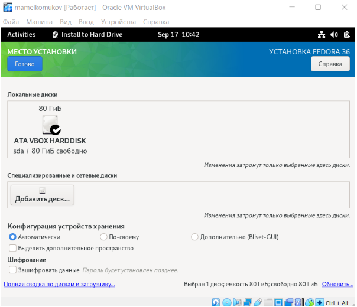

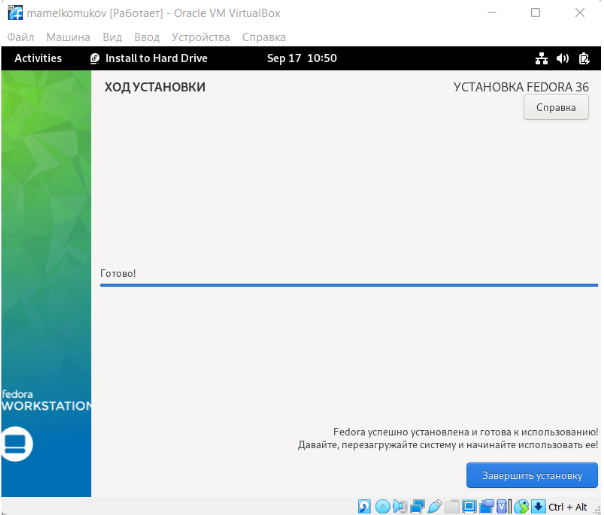

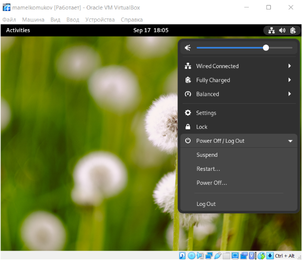

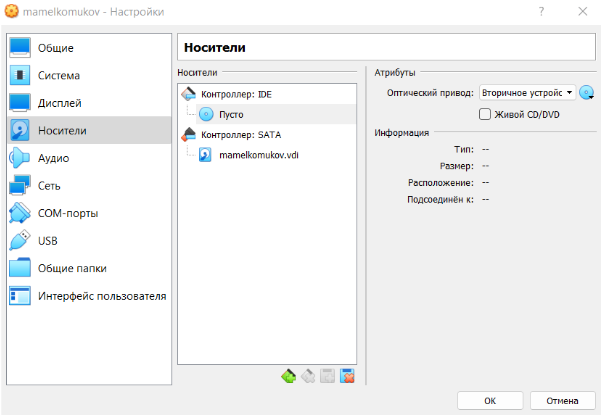

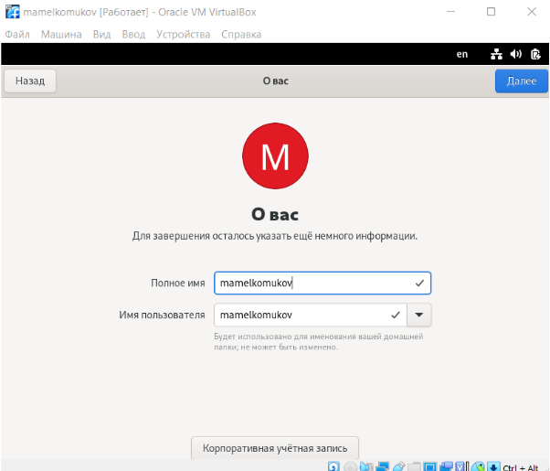

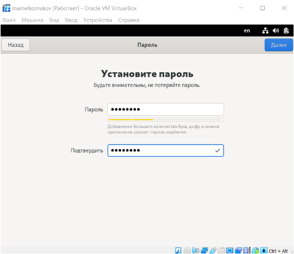

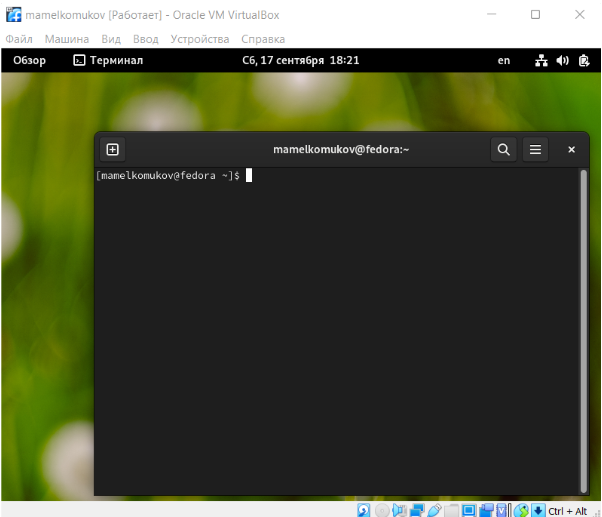

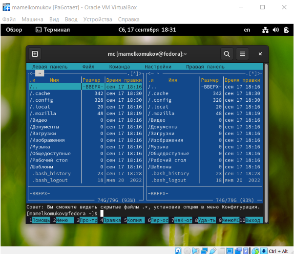

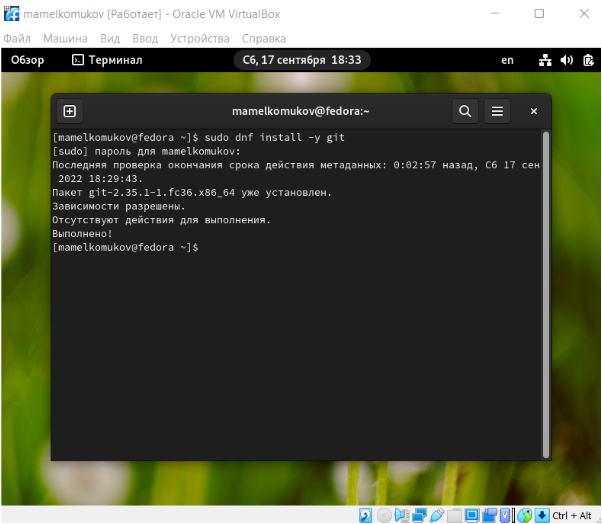

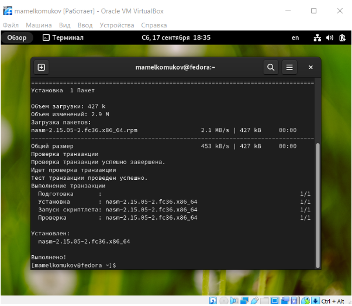

# Домашнее задание

В окне терминала проанализировали последовательность загрузки системы и получили следующую информацию:

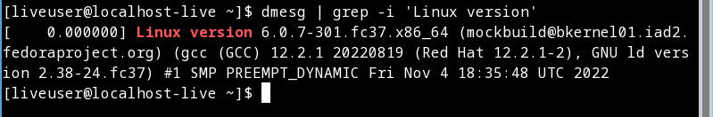

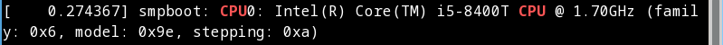

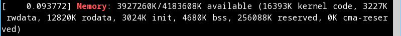

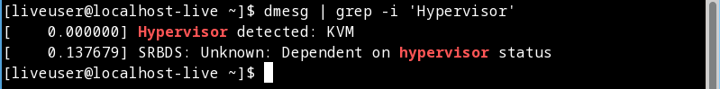

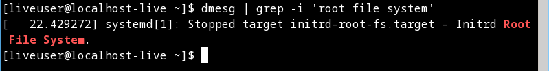

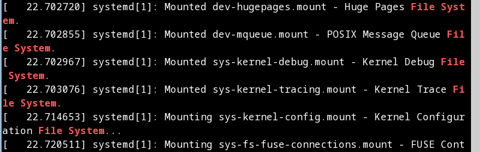

# Контрольные вопросы

1. Какую информацию содержит учётная запись пользователя?
Имя пользователя (user name)
Индентификационный номер пользователя (UID)
Индентификационный номер группы (GID)
Пароль (password)
Полное имя (full name)
Домашний каталог (home directory)
Начальную оболочку (login shell)

2. Укажите команды терминала и приведите примеры:
pwd (Print Working Directory_ - определение текущего каталога
cd (Change Directory) -  смена каталога
ls (LiSt) - вывод списка файлов
mkdir (MaKe DIRectory) - создание пустых каталогов
touch - создание пустых файлов
rm (ReMove) - удаление файлов или каталогов
mv (MoVe) - перемещение файлов и каталогов
cp (CoPy) - копирование файлов и каталогов
cat - вывод содержимого файлов

3. Что такое файловая система? Приведите примеры с краткой характеристикой.
Файловая система - порядок,определяющий способ организации, хранения и наименования данных на носителях информации в компьютерах, а также в другом электронном оборудовании: цифровых фотоаппаратах, мобильных телефонах и т.п.
Примеры: файловая система FAT, файловая система NTFS

4. Как посмотреть, какие файловые системы подмонтированы в ОС?
DF - утилита, показывающая список всех файловых систем по имени устройства, сообщает их размер, занятое и свободное пространство и точки монтирования. При выполнении без аргумента команда mount выводит все подключённые данные.

5. Как удалить зависший процесс?
С помощью команды killall-killall ().

# Выводы

Ознакомление с процессом установки ОС Linux на виртуальную машину
VirtualBox и настройкой основного программного обеспечения для дальнейшей
работы прошло успешно.

