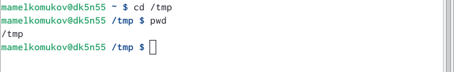
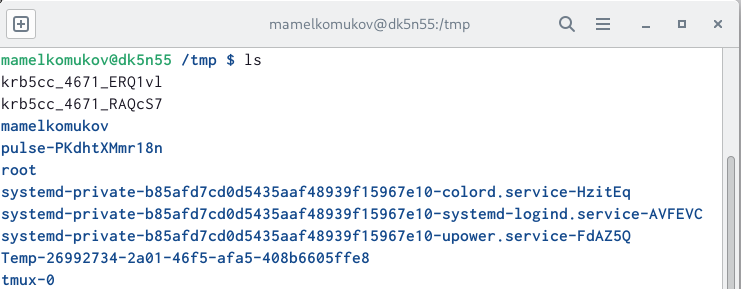
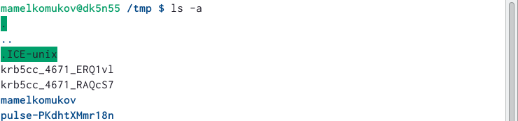
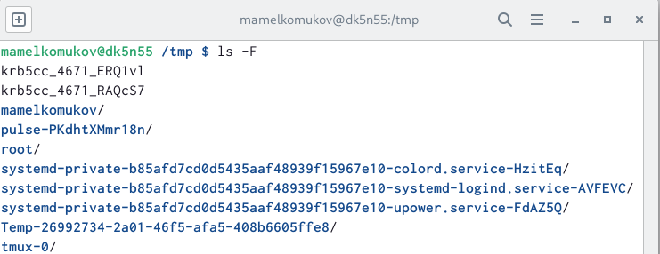
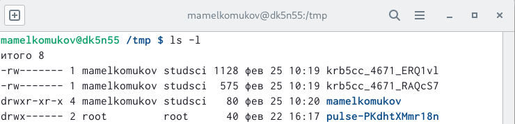
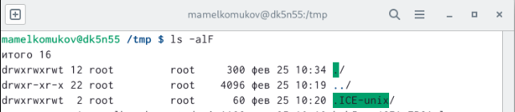
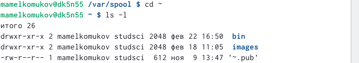
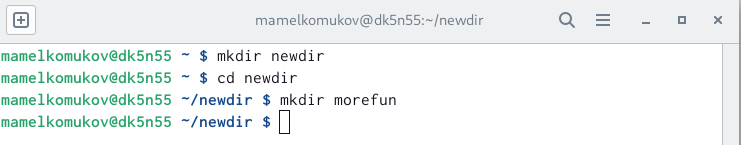
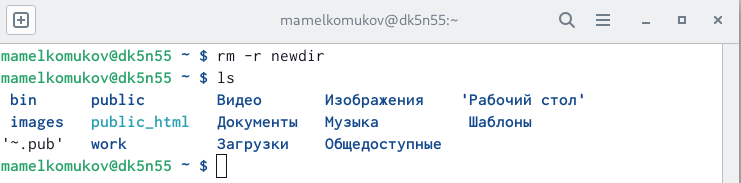
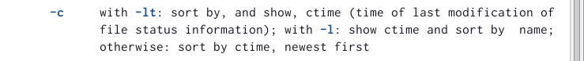

---
## Front matter
lang: ru-RU
title: Презентация по лабораторной работе №4
subtitle: Основы интерфейса взаимодействия пользователя с системой Unix на уровне командной строки
author:
  - Мелкомуков М. А.
institute:
  - Российский университет дружбы народов, Москва, Россия
date: 22 февраля 2023

## i18n babel
babel-lang: russian
babel-otherlangs: english

## Formatting pdf
toc: false
toc-title: Содержание
slide_level: 2
aspectratio: 169
section-titles: true
theme: metropolis
header-includes:
 - \metroset{progressbar=frametitle,sectionpage=progressbar,numbering=fraction}
 - '\makeatletter'
 - '\beamer@ignorenonframefalse'
 - '\makeatother'
---

# Информация

## Докладчик

:::::::::::::: {.columns align=center}
::: {.column width="70%"}

  * Мелкомуков Михаил Александрович
  * Студент группы НММбд-02-22
  * Направление Математика и Механика
  * Российский университет дружбы народов
  * [1132226465@rudn.ru](mailto:1132226465@rudn.ru)
  * <https://github.com/Alchemicael>

:::
::: {.column width="30%"}

:::
::::::::::::::

# Вводная часть

## Цель работы

Приобрести практические навыки взаимодействия пользователя с системой посредством командной строки.

## Задание

- Освоить команды командной строки
- Попрактиковать свои навыки, следуя инструкции
- Создать отчёт и презентацию
- Загрузить скринкасты на видео хостинг
- Загрузить файлы на GitHub
- Представить работу на сайте ТУИС

# Выполнение лабораторной работы

## Шаг 1

## Шаг 2

## Шаг 3

## Шаг 4

## Шаг 5

## Шаг 6

## Шаг 7

## Шаг 8

## Шаг 9

## Шаг 10

## Шаг 11

## Шаг 12

## Шаг 13

## Шаг 14

## Шаг 15

## Шаг 16

- Команды cd, pwd, mkdir, rmdir, rm и их основные опции:
- 1. cd 
- ~ - перейти в домашний каталог
- .. - перейти в предыдущий каталог
- 2. pwd 
- -L, --logical - брать директорию из переменной окружения, даже если она содержит символические ссылки
- -P - отбрасывать все символические ссылки

## Шаг 17

- Команды cd, pwd, mkdir, rmdir, rm и их основные опции:
- 3. mkdir
- -m, --mode - установить права доступа для создаваемой директории
- -p, --parents - создать все директории, которые указаны внутри пути
- -v, --verbose - выводить сообщение о каждой создаваемой директории
- 4. rmdir и rm
- -r, --recursive - рекурсивно удалить соедржиоме каталогов

## Шаг 18

# Контрольные вопросы

## Ответы 1

1. Командой в операционной системе называется записанный по специальным правилам текст (возможно с аргументами), представляющий собой указание на выполнение какой-либо функций (или действий) в операционной системе
2. Абсолютный путь текущего каталога можно определить с помощью команды pwd
3. Только тип файлов и их имена в текущем каталоге можно определить с помощью команды ls и опции -F 
4. Информации о скрытых файлах можно отобразить с помощью команды ls и опции -a
5. Файлы можно удалить с помощью команды rm, а каталоги с помощью команды rm и опции -r
6. Информацию о последних выполненных пользователем командах можно вывести с помощью команды history

## Ответы 2

7. Можно модифицировать команду из выведенного на экран списка при помощи следующей конструкции: !(номер команды):s/(что меняем)/(на что меняем)
8. Несколько команд запускаются в одной строке, если между ними поставить точку с запятой
9. Экранирование символов — замена в тексте управляющих символов на соответствующие текстовые подстановки
10. Относительный путь к файлу указывается из каталога, в котором находится пользователь. Абсолютный путь к файлу начинается с корневого каталога, например: /afs/dk.sci.pfu.edu.ru/home/d/h/mamelkomukov/work
11. Информацию об интересующей команде можно получить с помощью команды man
12. Для автоматического дополнения вводимых команд служит клавиша Tab

# Заключение

## Выводы

Приобрели практические навыки взаимодействия пользователя с системой посредством командной строки. Познакомились с новыми опциями команд с помощью команды man. Научились модифицировать команды из выведенного списка команд после ввода команды history.

