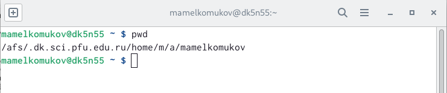
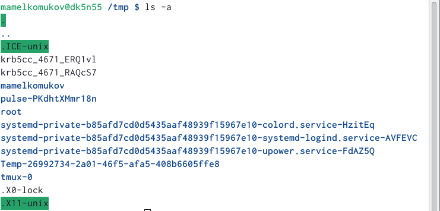
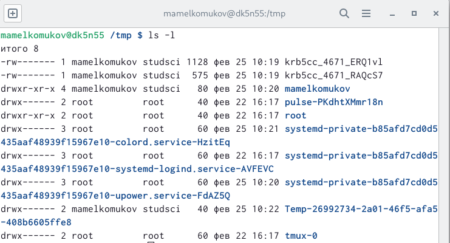
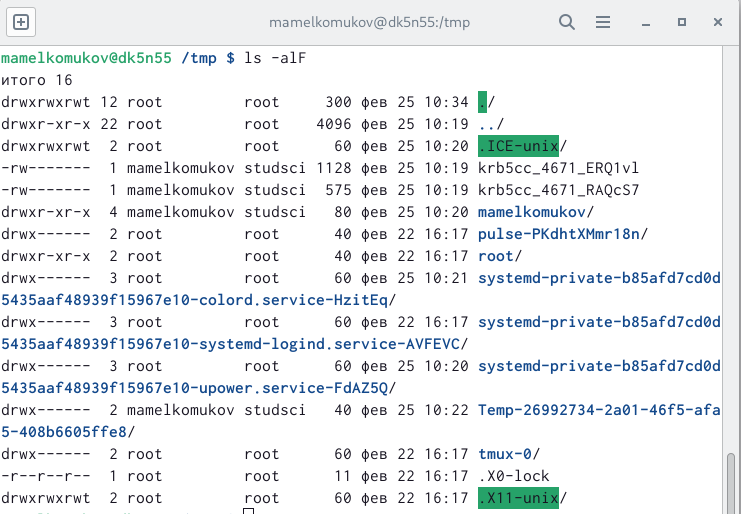
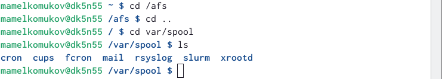
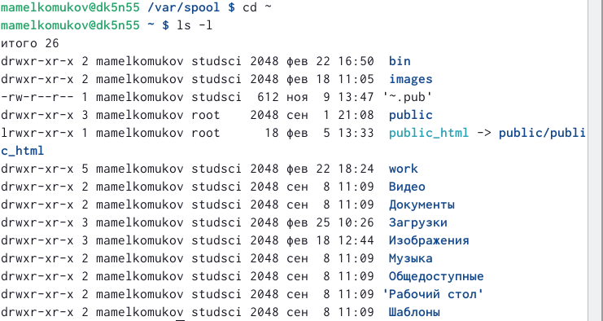
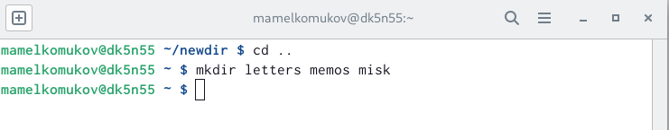
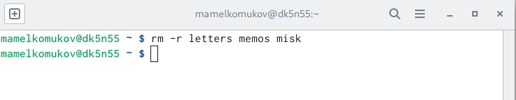
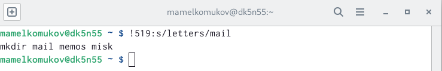

---
## Front matter
title: "Отчёт по лабораторной работе №4"
subtitle: "Основы интерфейса взаимодействия пользователя с системой Unix на уровне командной строки"
author: "Михаил Александрович Мелкомуков"

## Generic otions
lang: ru-RU
toc-title: "Содержание"

## Bibliography
bibliography: bib/cite.bib
csl: pandoc/csl/gost-r-7-0-5-2008-numeric.csl

## Pdf output format
toc: true # Table of contents
toc-depth: 2
lof: true # List of figures
lot: true # List of tables
fontsize: 12pt
linestretch: 1.5
papersize: a4
documentclass: scrreprt
## I18n polyglossia
polyglossia-lang:
  name: russian
  options:
	- spelling=modern
	- babelshorthands=true
polyglossia-otherlangs:
  name: english
## I18n babel
babel-lang: russian
babel-otherlangs: english
## Fonts
mainfont: PT Serif
romanfont: PT Serif
sansfont: PT Sans
monofont: PT Mono
mainfontoptions: Ligatures=TeX
romanfontoptions: Ligatures=TeX
sansfontoptions: Ligatures=TeX,Scale=MatchLowercase
monofontoptions: Scale=MatchLowercase,Scale=0.9
## Biblatex
biblatex: true
biblio-style: "gost-numeric"
biblatexoptions:
  - parentracker=true
  - backend=biber
  - hyperref=auto
  - language=auto
  - autolang=other*
  - citestyle=gost-numeric
## Pandoc-crossref LaTeX customization
figureTitle: "Рис."
tableTitle: "Таблица"
listingTitle: "Листинг"
lofTitle: "Список иллюстраций"
lotTitle: "Список таблиц"
lolTitle: "Листинги"
## Misc options
indent: true
header-includes:
  - \usepackage{indentfirst}
  - \usepackage{float} # keep figures where there are in the text
  - \floatplacement{figure}{H} # keep figures where there are in the text
---

# Цель работы

Приобрести практические навыки взаимодействия пользователя с системой посредством командной строки.

# Задание

- Освоить команды командной строки
- Попрактиковать свои навыки, следуя инструкции
- Создать отчёт и презентацию
- Загрузить скринкасты на видео хостинг
- Представить работу на сайте ТУИС

# Выполнение лабораторной работы

Команды cd, pwd, mkdir, rmdir, rm и их основные опции:
1. cd 
~ - перейти в домашний каталог
.. - перейти в предыдущий каталог
2. pwd 
-L, --logical - брать директорию из переменной окружения, даже если она содержит символические ссылки
-P - отбрасывать все символические ссылки
3. mkdir
-m, --mode - установить права доступа для создаваемой директории
-p, --parents - создать все директории, которые указаны внутри пути
-v, --verbose - выводить сообщение о каждой создаваемой директории
4. rmdir и rm
-r, --recursive - рекурсивно удалить соедржиоме каталогов

# Контрольные вопросы

1. Командой в операционной системе называется записанный по специальным правилам текст (возможно с аргументами), представляющий собой указание на выполнение какой-либо функций (или действий) в операционной системе
2. Абсолютный путь текущего каталога можно определить с помощью команды pwd
3. Только тип файлов и их имена в текущем каталоге можно определить с помощью команды ls и опции -F 
4. Информации о скрытых файлах можно отобразить с помощью команды ls и опции -a
5. Файлы можно удалить с помощью команды rm, а каталоги с помощью команды rm и опции -r
6. Информацию о последних выполненных пользователем командах можно вывести с помощью команды history
7. Можно модифицировать команду из выведенного на экран списка при помощи следующей конструкции: !(номер команды):s/(что меняем)/(на что меняем)
8. Несколько команд запускаются в одной строке, если между ними поставить точку с запятой
9. Экранирование символов — замена в тексте управляющих символов на соответствующие текстовые подстановки
10. Относительный путь к файлу указывается из каталога, в котором находится пользователь. Абсолютный путь к файлу начинается с корневого каталога, например: /afs/dk.sci.pfu.edu.ru/home/d/h/mamelkomukov/work
11. Информацию об интересующей команде можно получить с помощью команды man
12. Для автоматического дополнения вводимых команд служит клавиша Tab

# Выводы

Приобрели практические навыки взаимодействия пользователя с системой посредством командной строки. Познакомились с новыми опциями команд с помощью команды man. Научились модифицировать команды из выведенного списка команд после ввода команды history.

