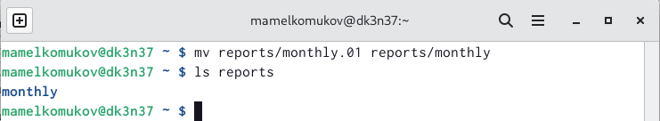
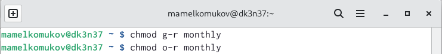
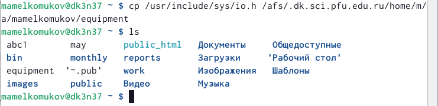

---
## Front matter
lang: ru-RU
title: Презентация по лабораторной работе №5
subtitle: Анализ файловой системы Linux. Команды для работы с файлами и каталогами
author:
  - Мелкомуков М. А.
institute:
  - Российский университет дружбы народов, Москва, Россия
date: 3 марта 2023

## i18n babel
babel-lang: russian
babel-otherlangs: english

## Formatting pdf
toc: false
toc-title: Содержание
slide_level: 2
aspectratio: 169
section-titles: true
theme: metropolis
header-includes:
 - \metroset{progressbar=frametitle,sectionpage=progressbar,numbering=fraction}
 - '\makeatletter'
 - '\beamer@ignorenonframefalse'
 - '\makeatother'
---

# Информация

## Докладчик

:::::::::::::: {.columns align=center}
::: {.column width="70%"}

  * Мелкомуков Михаил Александрович
  * Студент группы НММбд-02-22
  * Направление Математика и Механика
  * Российский университет дружбы народов
  * [1132226465@rudn.ru](mailto:1132226465@rudn.ru)
  * <https://github.com/Alchemicael>

:::
::: {.column width="30%"}

:::
::::::::::::::

# Вводная часть

## Цель работы

Ознакомиться с файловой системой Linux, её структурой, именами и содержанием каталогов. Приобрести практические навыки по применению команд для работы с файлами и каталогами, по управлению процессами (и работами), по проверке использования диска и обслуживанию файловой системы.

## Задание

- Выполнить все примеры, приведённые в первой части описания лабораторной работы
- Выполните действия, зафиксировав в отчёте по лабораторной работе используемые при этом команды и результаты их выполнения
- Создать отчёт и презентацию в Markdown
- Загрузить скринкасты на видео хостинг
- Представить работу на сайте ТУИС

# Выполнение лабораторной работы

# Выполнение примеров

## Шаг 1 

## Шаг 2

## Шаг 3

## Шаг 4

## Шаг 5

## Шаг 6

## Шаг 7

## Шаг 8

## Шаг 9

## Шаг 10

## Шаг 11

## Шаг 12

## Шаг 13

## Шаг 14

## Шаг 15

# Выполнение заданий

## Шаг 16

## Шаг 17

## Шаг 18

## Шаг 19

## Шаг 20

## Шаг 21

# Определение опции команды chmod

## Определение опции команды chmod

1. australia (a+r u+w u+x)
2. play (a+x u+r u+w)
3. my_os (a+r u+x)
4. feathers (a+r a+w o-w)

# Выполнение упражнений

## Выполнение упражнений

1. Просмотрели содержимое файла с помощью команды ls /etc/password
2. Скопировали файл ~/feathers в файл ~/file.old с помощью команды cp ~/feathers ~/file.old
3. Переместили файл ~/file.old в каталог ~/play с помощью команды mv file.old ~/play
4. Скопировали каталог ~/play в каталог ~/fun с помощью команды cp
5. Переместили каталог ~/fun в каталог ~/play и назовите его games с помощью команды mv ~/fun ~/play/games
6. Лишили владельца файла ~/feathers права на чтение с помощью команды chmod u-r

## Выполнение упражнений

7. Если просмотреть файл ~/feathers командой cat, то выдаётся ошибка "Отказано в доступе"
8. Скопировать файл feathers не удаётся по той же ошибке
9. Дали владельцу файла ~/feathers право на чтение с помощью команды chmod u+r
10. Лишили владельца каталога ~/play права на выполнение с помощью команды chmod u-x
11. После выполнения команды перейти в каталог play не представляется возможным
12. Дали владельцу каталога ~/play право на выполнение с помощью команды chmod u+x

# Краткая характеристика команд

## Краткая характеристика команд

1. mount монтирует файловую систему
2. fsck проверяет и исправляет ошибки файловой системы
3. mkfs создаёт новую файловую систему
4. kill принудительно завершает работу определённого процесса

# Заключение

## Выводы

Ознакомились с файловой системой Linux, её структурой, именами и содержанием каталогов. Приобрели практические навыки по применению команд для работы с файлами и каталогами, по управлению процессами (и работами), по проверке использования диска и обслуживанию файловой системы.

