---
## Front matter
lang: ru-RU
title: Презентация по лабораторной работе №7
subtitle: Командная оболочка Midnight Commander
author:
  - Мелкомуков М. А.
institute:
  - Российский университет дружбы народов, Москва, Россия
date: 10 марта 2023

## i18n babel
babel-lang: russian
babel-otherlangs: english

## Formatting pdf
toc: false
toc-title: Содержание
slide_level: 2
aspectratio: 169
section-titles: true
theme: metropolis
header-includes:
 - \metroset{progressbar=frametitle,sectionpage=progressbar,numbering=fraction}
 - '\makeatletter'
 - '\beamer@ignorenonframefalse'
 - '\makeatother'
---

# Информация

## Докладчик

:::::::::::::: {.columns align=center}
::: {.column width="70%"}

  * Мелкомуков Михаил Александрович
  * Студент группы НММбд-02-22
  * Направление Математика и Механика
  * Российский университет дружбы народов
  * [1132226465@rudn.ru](mailto:1132226465@rudn.ru)
  * <https://github.com/Alchemicael>

:::
::: {.column width="30%"}

:::
::::::::::::::

# Вводная часть

## Цель работы

Освоение основных возможностей командной оболочки Midnight Commander. Приобретение навыков практической работы по просмотру каталогов и файлов, манипуляций с ними.

## Задание

- Рассмотреть выполнение команд, приведённых в первой части описания лабораторной работы
- Выполнить действия, зафиксировав в отчёте по лабораторной работе используемые при этом команды и результаты их выполнения
- Создать отчёт и презентацию в Markdown
- Загрузить скринкасты на видео хостинг
- Представить работу на сайте ТУИС

# Выполнение лабораторной работы

# Выполнение задания по mc

## Шаг 1

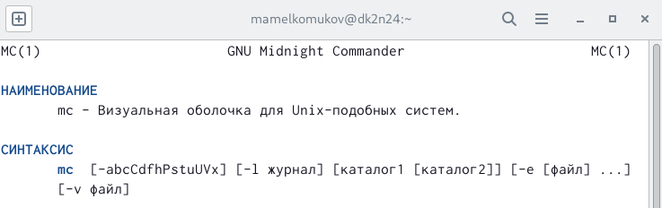

## Шаг 2

## Шаг 3

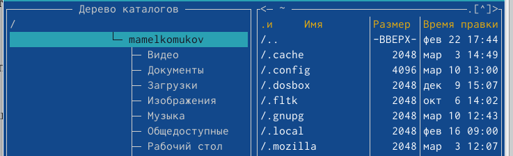

## Шаг 4

## Шаг 5

## Шаг 6

## Шаг 7

## Шаг 8

## Шаг 9

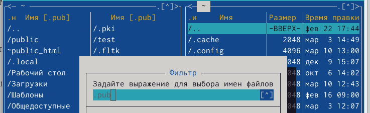

## Шаг 10

## Шаг 11

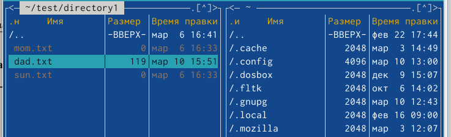

## Шаг 12

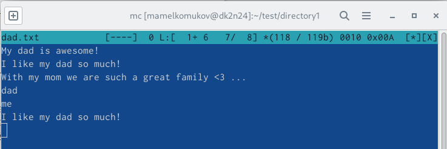

## Шаг 13

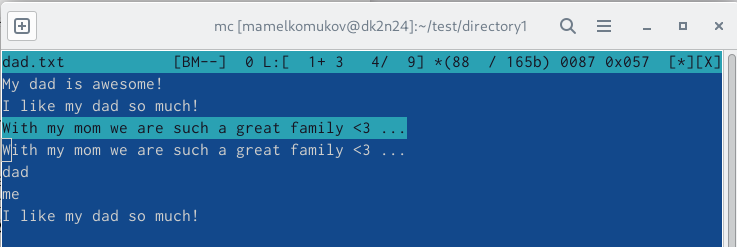

## Шаг 14

## Шаг 15

## Шаг 16

## Шаг 17

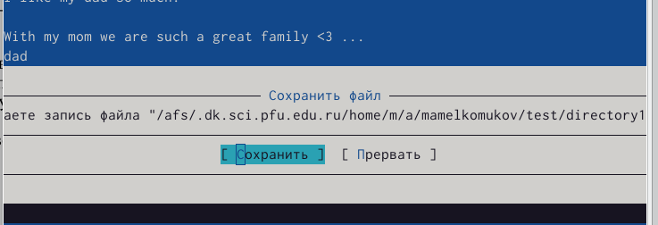

## Шаг 18

## Шаг 19

## Шаг 20

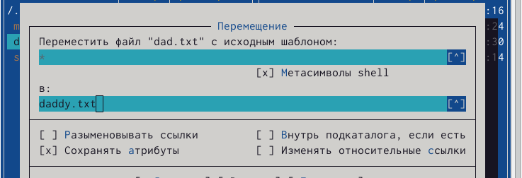

## Шаг 21

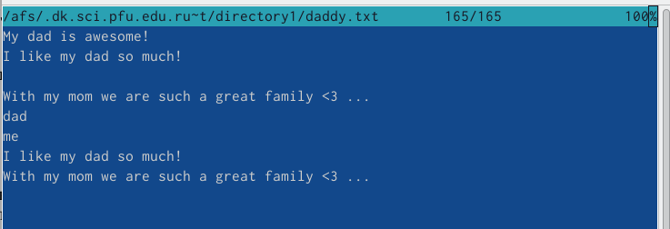

## Шаг 22

## Шаг 23

## Шаг 24

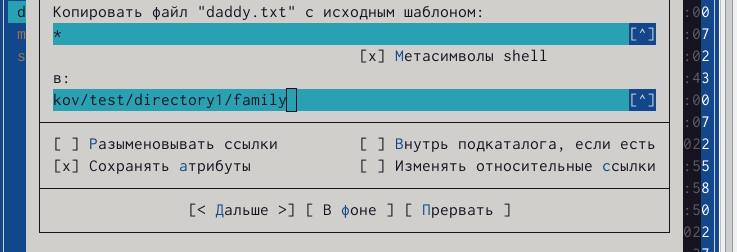

## Шаг 25

## Шаг 26

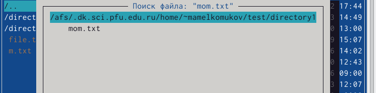

## Шаг 27

## Шаг 28

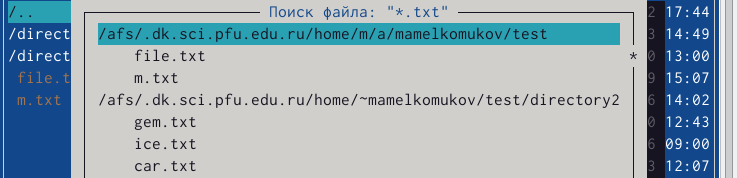

## Шаг 29

## Шаг 30

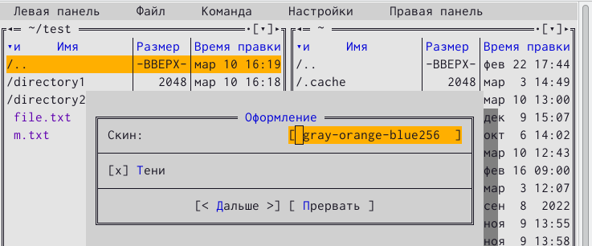

# Выполнение задания по встроенному редактору mc

## Шаг 31

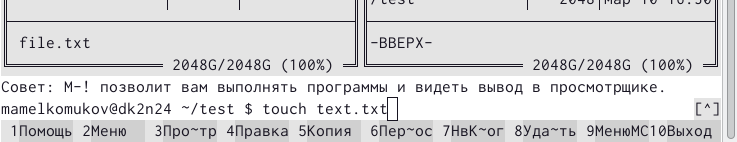

## Шаг 32

## Шаг 33

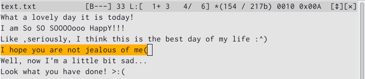

## Шаг 34

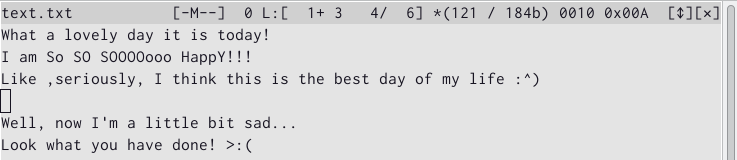

## Шаг 35

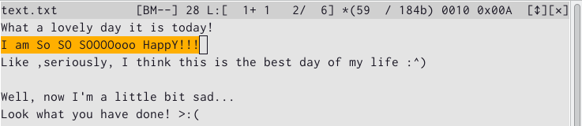

## Шаг 36

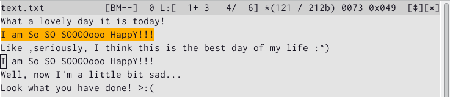

## Шаг 37

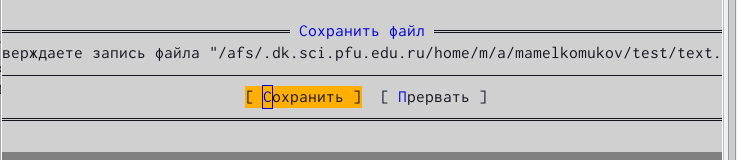

## Шаг 38

## Шаг 39

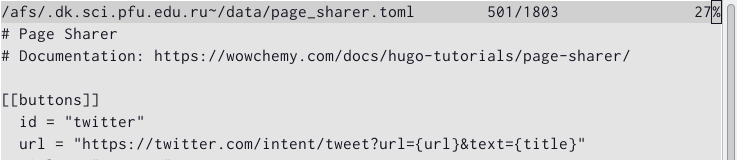

## Шаг 40

# Контрольные вопросы

Ответы на контрольные вопросы следуют из хода выполнения лабораторной работы. Большинство операций в меню командная оболочка Midnight Commander были выполнены и охарактеризованы (сочетания клавиш для их быстрого выполнения были так же указаны).

# Заключение

## Выводы

Освоили основные возможности командной оболочки Midnight Commander. Приобрели навыки практической работы по просмотру каталогов и файлов, манипуляций с ними.

