---
## Front matter
title: "Отчёт по лабораторной работе №7"
subtitle: "Командная оболочка Midnight Commander"
author: "Михаил Александрович Мелкомуков"

## Generic otions
lang: ru-RU
toc-title: "Содержание"

## Bibliography
bibliography: bib/cite.bib
csl: pandoc/csl/gost-r-7-0-5-2008-numeric.csl

## Pdf output format
toc: true # Table of contents
toc-depth: 2
lof: true # List of figures
lot: true # List of tables
fontsize: 12pt
linestretch: 1.5
papersize: a4
documentclass: scrreprt
## I18n polyglossia
polyglossia-lang:
  name: russian
  options:
	- spelling=modern
	- babelshorthands=true
polyglossia-otherlangs:
  name: english
## I18n babel
babel-lang: russian
babel-otherlangs: english
## Fonts
mainfont: PT Serif
romanfont: PT Serif
sansfont: PT Sans
monofont: PT Mono
mainfontoptions: Ligatures=TeX
romanfontoptions: Ligatures=TeX
sansfontoptions: Ligatures=TeX,Scale=MatchLowercase
monofontoptions: Scale=MatchLowercase,Scale=0.9
## Biblatex
biblatex: true
biblio-style: "gost-numeric"
biblatexoptions:
  - parentracker=true
  - backend=biber
  - hyperref=auto
  - language=auto
  - autolang=other*
  - citestyle=gost-numeric
## Pandoc-crossref LaTeX customization
figureTitle: "Рис."
tableTitle: "Таблица"
listingTitle: "Листинг"
lofTitle: "Список иллюстраций"
lotTitle: "Список таблиц"
lolTitle: "Листинги"
## Misc options
indent: true
header-includes:
  - \usepackage{indentfirst}
  - \usepackage{float} # keep figures where there are in the text
  - \floatplacement{figure}{H} # keep figures where there are in the text
---

# Цель работы

Освоение основных возможностей командной оболочки Midnight Commander. Приобретение навыков практической работы по просмотру каталогов и файлов, манипуляций с ними.

# Задание

- Рассмотреть выполнение команд, приведённых в первой части описания лабораторной работы
- Выполнить действия, зафиксировав в отчёте по лабораторной работе используемые при этом команды и результаты их выполнения
- Создать отчёт и презентацию в Markdown
- Загрузить скринкасты на видео хостинг
- Представить работу на сайте ТУИС

# Выполнение лабораторной работы

## Выполнение задания по mc

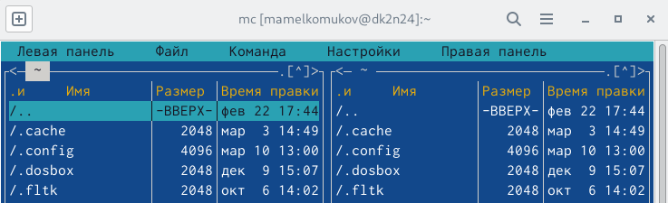

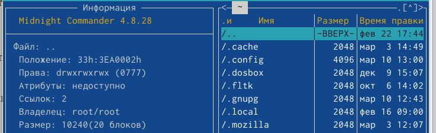

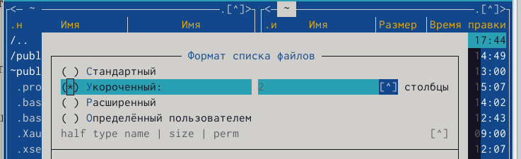

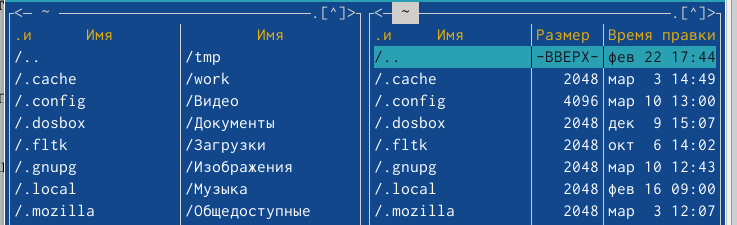

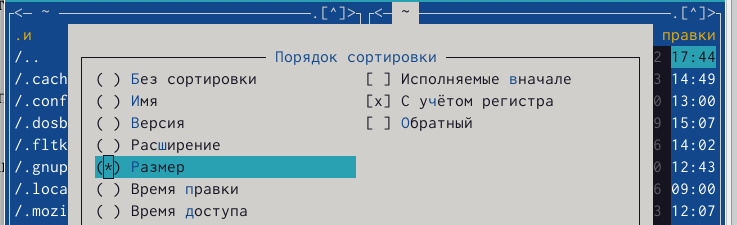

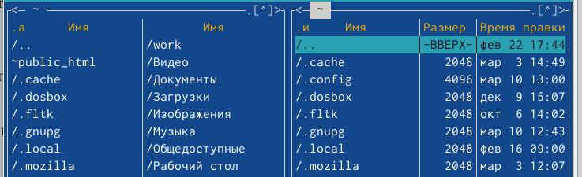

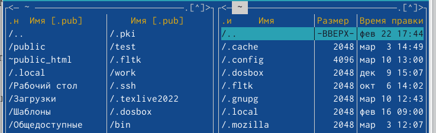

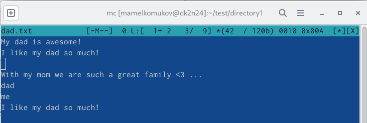

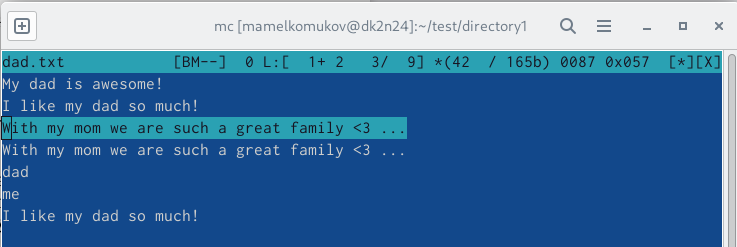

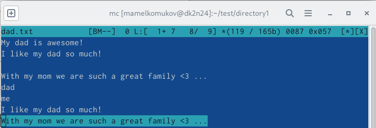

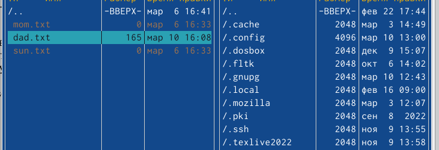

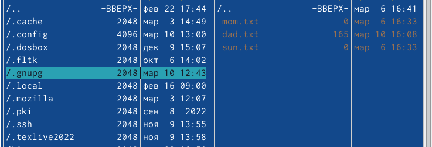

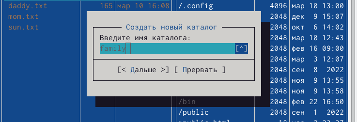

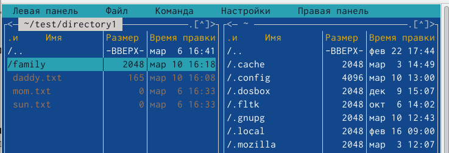

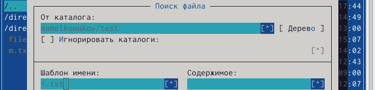

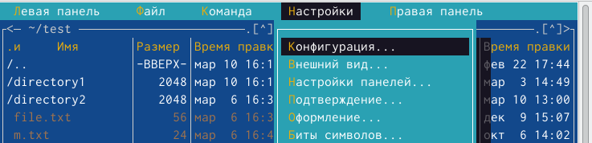

## Выполнение задания по встроенному редактору mc

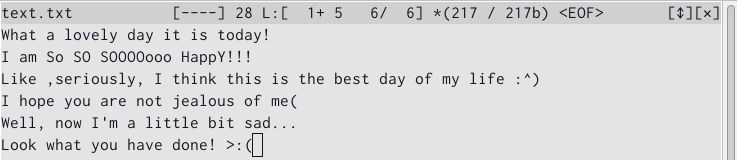

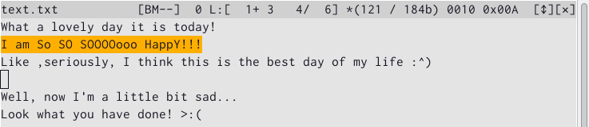

# Контрольные вопросы

Ответы на контрольные вопросы следуют из хода выполнения лабораторной работы. Большинство операций в меню командная оболочка Midnight Commander были выполнены и охарактеризованы (сочетания клавиш для их быстрого выполнения были так же указаны).

# Выводы

Освоили основные возможности командной оболочки Midnight Commander. Приобрели навыки практической работы по просмотру каталогов и файлов, манипуляций с ними.

