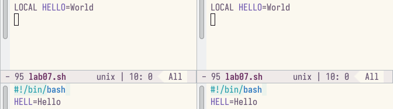

---
## Front matter
lang: ru-RU
title: Презентация по лабораторной работе №9
subtitle: Текстовый редактор emacs
author:
  - Мелкомуков М. А.
institute:
  - Российский университет дружбы народов, Москва, Россия
date: 20 марта 2023

## i18n babel
babel-lang: russian
babel-otherlangs: english

## Formatting pdf
toc: false
toc-title: Содержание
slide_level: 2
aspectratio: 169
section-titles: true
theme: metropolis
header-includes:
 - \metroset{progressbar=frametitle,sectionpage=progressbar,numbering=fraction}
 - '\makeatletter'
 - '\beamer@ignorenonframefalse'
 - '\makeatother'
---

# Информация

## Докладчик

:::::::::::::: {.columns align=center}
::: {.column width="70%"}

  * Мелкомуков Михаил Александрович
  * Студент группы НММбд-02-22
  * Направление Математика и Механика
  * Российский университет дружбы народов
  * [1132226465@rudn.ru](mailto:1132226465@rudn.ru)
  * <https://github.com/Alchemicael>

:::
::: {.column width="30%"}

:::
::::::::::::::

# Вводная часть

## Цель работы

Познакомиться с операционной системой Linux. Получить практические навыки работы с редактором Emacs.

## Задание

- Ознакомиться с теоретическим материалом
- Ознакомиться с редактором emacs
- Выполнить упражнения
- Создать отчёт и презентацию в Markdown
- Загрузить скринкасты на видео хостинг
- Представить работу на сайте ТУИС

# Выполнение лабораторной работы

## Шаг 1

## Шаг 2

## Шаг 3

## Шаг 4

## Шаг 5

## Шаг 6

## Шаг 7

## Шаг 8

## Шаг 9

## Шаг 10

## Шаг 11

## Шаг 12

## Шаг 13

## Шаг 14

## Шаг 15

## Шаг 16

## Шаг 17

## Шаг 18

## Шаг 19

## Шаг 20

## Шаг 21

# Заключение

## Выводы

Познакомились с операционной системой Linux. Получили практические навыки работы с редактором Emacs.

