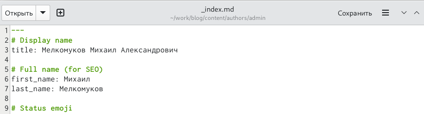
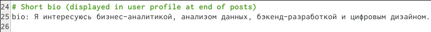
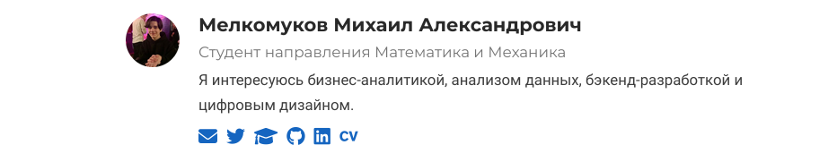
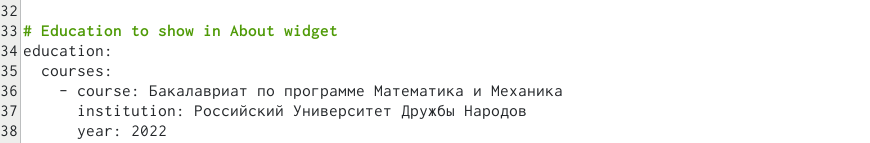
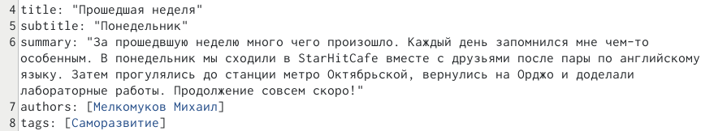
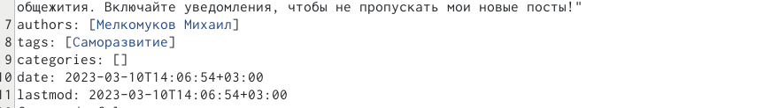

---
## Front matter
lang: ru-RU
title: Презентация по выполнению индивидуального проекта
subtitle: Этап 2 Добавление к сайту данных о владельце
author:
  - Мелкомуков М. А.
institute:
  - Российский университет дружбы народов, Москва, Россия
date: 10 марта 2023

## i18n babel
babel-lang: russian
babel-otherlangs: english

## Formatting pdf
toc: false
toc-title: Содержание
slide_level: 2
aspectratio: 169
section-titles: true
theme: metropolis
header-includes:
 - \metroset{progressbar=frametitle,sectionpage=progressbar,numbering=fraction}
 - '\makeatletter'
 - '\beamer@ignorenonframefalse'
 - '\makeatother'
---

# Информация

## Докладчик

:::::::::::::: {.columns align=center}
::: {.column width="70%"}

  * Мелкомуков Михаил Александрович
  * Студент группы НММбд-02-22
  * Направление Математика и Механика
  * Российский университет дружбы народов
  * [1132226465@rudn.ru](mailto:1132226465@rudn.ru)
  * <https://github.com/Alchemicael>

:::
::: {.column width="30%"}

:::
::::::::::::::

# Вводная часть

## Цель работы

Целью работы является освоение новых команд терминала, связанных с конструктором статических веб-сайтов Hugo, приобретение практических навыков изменения информации о владельце сайта и добавления новых постов, а также более детальное изучение файлов директории blog персонального проекта.

## Задание

Добавить к сайту данные о себе. Разместить фотографию владельца сайта. Разместить краткое описание владельца сайта (Biography). Добавить информацию об интересах (Interests). Добавить информацию об образовании (Education). Создать два поста по прошедшей неделе: о понедельнике и вторнике.

# Выполнение лабораторной работы

## Шаг 1

## Шаг 2

## Шаг 3

## Шаг 4

## Шаг 5

## Шаг 6

## Шаг 7

## Шаг 8

## Шаг 9

## Шаг 10

## Шаг 11

## Шаг 12

# Заключение

## Выводы

Освоили новые команды терминала, связанные с конструктором статических веб-сайтов Hugo, приобрели практические навыки изменения информации о владельце сайта и добавления новых постов, а также лучше познакомились с файлами в директории blog персонального проекта.

