---
## Front matter
lang: ru-RU
title: Презентация по выполнению индивидуального проекта
subtitle: Этап 3 Достижения, опыт и навыки
author:
  - Мелкомуков М. А.
institute:
  - Российский университет дружбы народов, Москва, Россия
date: 7 апреля 2023

## i18n babel
babel-lang: russian
babel-otherlangs: english

## Formatting pdf
toc: false
toc-title: Содержание
slide_level: 2
aspectratio: 169
section-titles: true
theme: metropolis
header-includes:
 - \metroset{progressbar=frametitle,sectionpage=progressbar,numbering=fraction}
 - '\makeatletter'
 - '\beamer@ignorenonframefalse'
 - '\makeatother'
---

# Информация

## Докладчик

:::::::::::::: {.columns align=center}
::: {.column width="70%"}

  * Мелкомуков Михаил Александрович
  * Студент группы НММбд-02-22
  * Направление Математика и Механика
  * Российский университет дружбы народов
  * [1132226465@rudn.ru](mailto:1132226465@rudn.ru)
  * <https://github.com/Alchemicael>

:::
::: {.column width="30%"}

:::
::::::::::::::

# Вводная часть

## Цель работы

Продолжить работы со своим сайтом. Редактировать его в соответствии с требованиями. Добавить данные о своих достижениях.

## Задание

- Добавить информацию о навыках (Skills)
- Добавить информацию об опыте (Experience)
- Добавить информацию о достижениях (Accomplishments)
- Сделать пост по прошедшей неделе

# Выполнение лабораторной работы

## Шаг 1

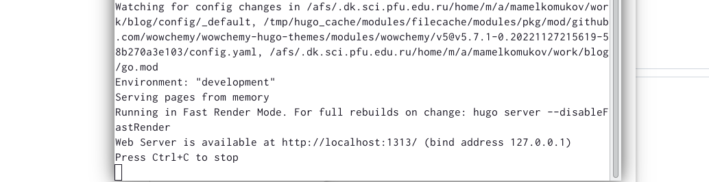

## Шаг 2

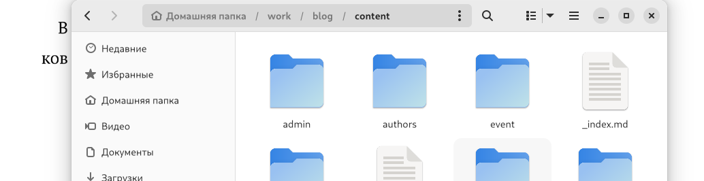

## Шаг 3

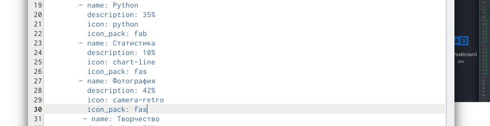

## Шаг 4

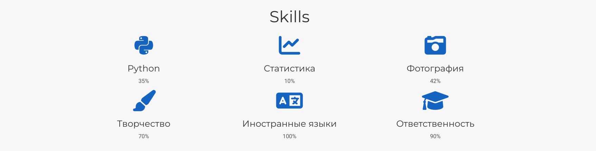

## Шаг 5

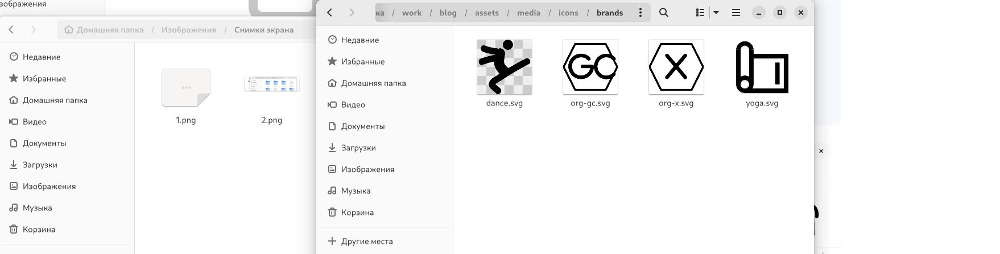

## Шаг 6

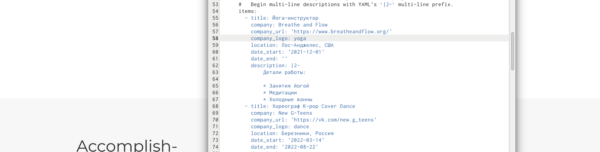

## Шаг 7

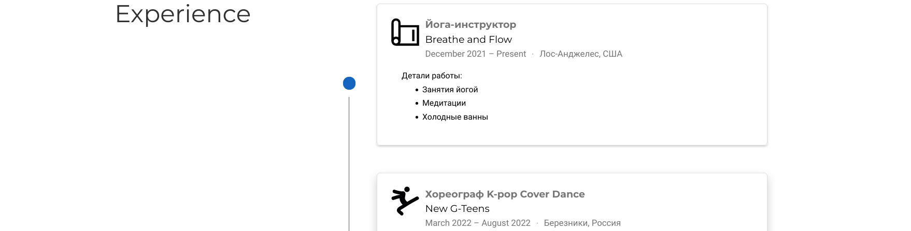

## Шаг 8

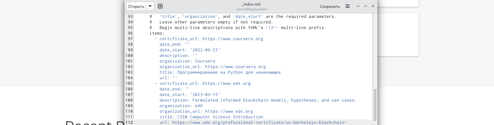

## Шаг 9

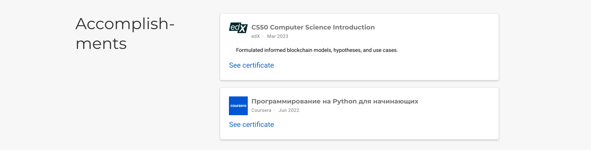

## Шаг 10

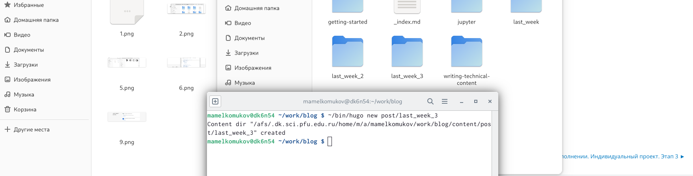

## Шаг 11

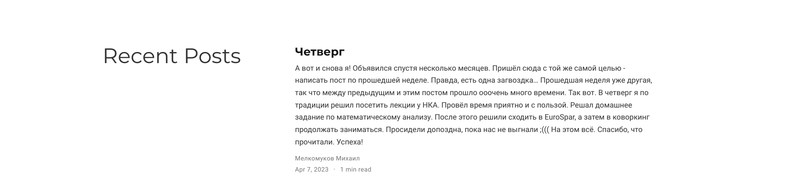

# Заключение

## Выводы

Продолжили работу со своим сайтом. Отредактировали его в соответствии с требованиями. Добавили данные о своих достижениях.

